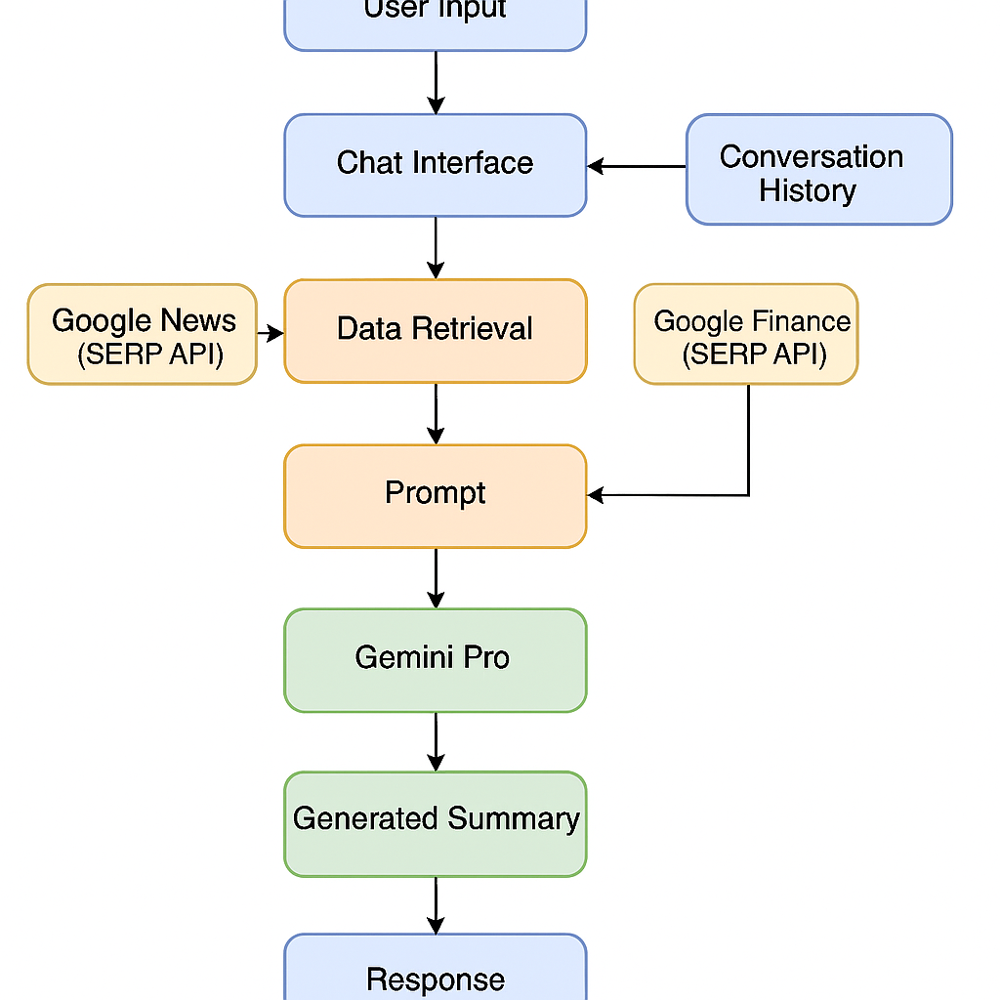

# 🤖 AI Trading Assistant: Real-Time RAG with LLMs

This project demonstrates how **Large Language Models (LLMs)** and **Retrieval-Augmented Generation (RAG)** can be used to deliver **actionable financial trading insights**. By integrating **Gemini Pro (Google's LLM)** with real-time data retrieval using the **SERP API**, the chatbot provides expert-level market guidance through a Streamlit interface.

---

## 💡 Key Features

- **Retrieval-Augmented Generation (RAG):** Combines external real-time data from Google News and Google Finance to enhance LLM responses with factual grounding (Lewis et al., 2020).
- **LLM-Driven Summarization:** Uses Gemini Pro to produce structured, high-quality financial summaries with numerical precision.
- **Context-Aware Conversational Memory:** Maintains chat history using Streamlit session state to ensure coherent, ongoing dialogue.
- **Real-Time Financial Data:** Uses Google SERP API to fetch the latest stock updates and company fundamentals on demand.

---

## ⚙️ Architecture

  
*A high-level flow of user input, retrieval, prompting, and response generation.*

---

## 🧠 Technologies Used

| Component | Description |
|----------|-------------|
| `google.generativeai` | Accesses Gemini Pro (LLM) for intelligent summarization |
| `requests` | Calls SERP API for live data retrieval |
| `streamlit` | UI framework for chat interaction |
| `SERP API` | Retrieves structured data from Google News & Finance |

---

## 💬 Sample Use Case

> **User:** "What’s going on with NVIDIA stock?"  
> **AI:** *Pulls recent news and financials, then responds with a Gemini Pro-generated summary including earnings, analyst ratings, and strategic guidance.*

---

## 🔁 How It Works

1. User enters a query (e.g., "Tesla stock update").
2. The app retrieves real-time news + financial data using the SERP API.
3. A prompt is constructed combining:
   - Retrieved facts
   - Chat history
   - Expert trader persona
4. Gemini Pro generates a structured summary tailored for financial decision-making.

---

## 📦 Installation

```bash
pip install -r requirements.txt
streamlit run chatbot.py
```

## 📁 Repository Structure
ai-trading-chatbot/
├── Hackathon.py              # Streamlit app with RAG logic
├── run_hackathon.bat         # Launch script
├── visuals/                  # RAG architecture diagram
├── data/sample_conversation.txt
├── requirements.txt
└── README.md

## 🧪 Future Enhancements

- Fine-tuned RAG prompts based on trader profiles (e.g., swing vs. intraday)

- Chat history summarization for long-term context

- Embedding vector store for internal document retrieval (e.g., financial PDFs)